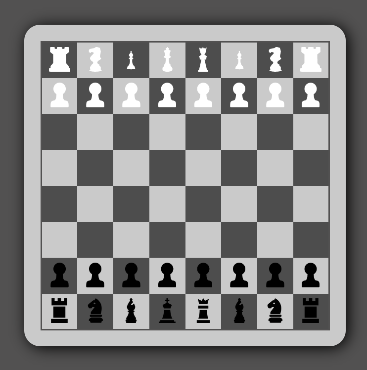

# game4webdev.github.io

game for web design lessons



```
.
├── img
│   ├── blackF.png
│   ├── blackK.png
│   ├── blackKg.png
│   ├── blackP.svg
│   ├── blackS.png
│   ├── blackT.png
│   ├── whiteF.svg
│   ├── whiteK.svg
│   ├── whiteKg.svg
│   ├── whiteP.svg
│   ├── whiteS.svg
│   └── whiteT.svg
├── index.html
└── style.css

1 directory, 14 files
```
